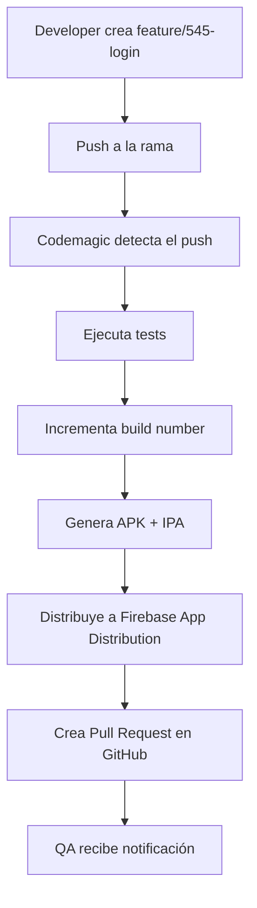

# Guía de CI/CD con Codemagic

## 📋 Resumen

Este proyecto implementa un pipeline CI/CD automatizado que:
- Genera builds automáticamente cuando se hace push a ramas `feature/*`
- Distribuye las apps a QA vía Firebase App Distribution
- Crea Pull Requests automáticamente en GitHub
- Incrementa el build number automáticamente

## 🔄 Flujo del Workflow

## 🛠️ Configuración Requerida

### 1. Firebase App Distribution
- Proyecto Firebase configurado
- App Distribution habilitado
- Grupos de testers creados
- Credenciales de servicio configuradas

### 2. Codemagic
- Repositorio conectado
- Variables de entorno configuradas
- Certificados iOS subidos (si aplica)

### 3. GitHub
- Personal Access Token con permisos de repo
- Permisos de escritura habilitados

## 📁 Archivos Importantes

### `codemagic.yaml`
Configuración principal del pipeline CI/CD que define:
- Triggers (cuándo ejecutar)
- Scripts (qué hacer)
- Artifacts (qué generar)
- Publishing (dónde distribuir)

### `scripts/`
- `increment_build_number.sh`: Incrementa el build number automáticamente
- `create_pr.sh`: Crea Pull Requests automáticamente

## 🚀 Uso del Workflow

### Para Desarrolladores
1. Crear rama: `git checkout -b feature/545-nueva-funcionalidad`
2. Hacer cambios y commits
3. Push: `git push origin feature/545-nueva-funcionalidad`
4. El pipeline se ejecuta automáticamente

### Para QA
1. Recibir notificación de Firebase App Distribution
2. Descargar la app desde el enlace
3. Probar la funcionalidad
4. Reportar issues en el Pull Request

## 🔧 Variables de Entorno en Codemagic

| Variable | Descripción | Requerida |
|----------|-------------|-----------|
| `FIREBASE_SERVICE_ACCOUNT` | JSON de cuenta de servicio Firebase | ✅ |
| `GITHUB_TOKEN` | Token de GitHub para crear PRs | ✅ |
| `FIREBASE_APP_ID_ANDROID` | App ID de Firebase para Android | ✅ |
| `FIREBASE_APP_ID_IOS` | App ID de Firebase para iOS | ✅ |
| `IOS_CERTIFICATE_PRIVATE_KEY` | Certificado iOS (si aplica) | ⚠️ |
| `IOS_PROVISIONING_PROFILE` | Provisioning profile iOS (si aplica) | ⚠️ |

## 🐛 Troubleshooting

### Error: "Firebase service account not found"
- Verificar que la variable `FIREBASE_SERVICE_ACCOUNT` esté configurada
- Asegurar que el JSON sea válido

### Error: "GitHub PR creation failed"
- Verificar que `GITHUB_TOKEN` tenga permisos suficientes
- Comprobar que el repositorio permita creación de PRs vía API

### Error: "iOS build failed"
- Verificar certificados iOS en Codemagic
- Comprobar provisioning profiles

### Build number no se incrementa
- Verificar que el script `increment_build_number.sh` sea ejecutable
- Comprobar formato del `pubspec.yaml`

## 📊 Monitoreo

### Codemagic Dashboard
- Ver builds en tiempo real
- Revisar logs de errores
- Descargar artifacts

### Firebase App Distribution
- Ver historial de distribuciones
- Gestionar grupos de testers
- Ver estadísticas de instalaciones

## 🔄 Replicar en Otros Proyectos

1. Copiar `codemagic.yaml` al nuevo proyecto
2. Actualizar variables de entorno en Codemagic
3. Configurar Firebase para el nuevo proyecto
4. Ajustar nombres de paquetes y IDs
5. Probar con una rama feature

## 📞 Soporte

Para issues o preguntas:
- Revisar logs en Codemagic
- Consultar documentación de Firebase
- Contactar al equipo de DevOps
